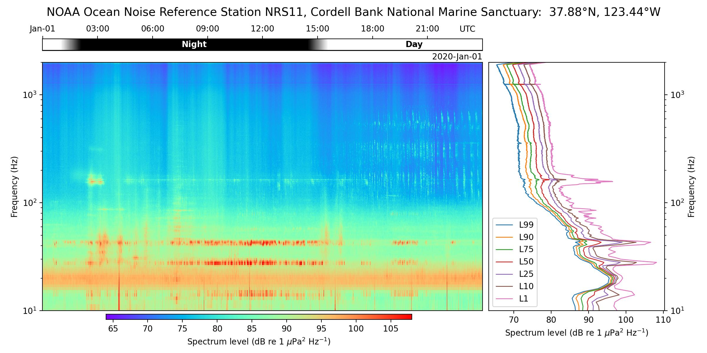

!!! note
    This is a placeholder for the documentation of the `pbp-plot` command-line program.

# Main program

```shell
$ pbp-plot --help
```
```text
usage: pbp-plot [-h] [--version] [--latlon lat lon] [--title string] [--ylim lower upper] [--cmlim vmin vmax] [--dpi value] [--show] [--only-show]
               netcdf [netcdf ...]

Generate summary plots for given netcdf files.

positional arguments:
  netcdf              netcdf file(s) to plot

optional arguments:
  -h, --help          show this help message and exit
  --version           show program's version number and exit
  --latlon lat lon    Lat/Lon for solar position calculation . Default: (36.7128, -122.186)
  --title string      Title for the plot. Default: 'MBARI MARS Cabled Observatory   Monterey Bay, California, USA   36.7128 °N, -122.186 °W'
  --ylim lower upper  Limits for the y-axis. Default: (10, 100000)
  --cmlim vmin vmax   Parameters passed to pcolormesh. Default: (32, 108)
  --dpi value         DPI to use for the plot. Default: 200
  --show              Also show the plot
  --only-show         Only show the plot (do not generate .jpg files)
```

# Examples

```shell
pbp-plot \
     --ylim 10 2000 \
     --cmlim 64 108 \
     --latlon 37.88 -123.44 \
     --title "NOAA Ocean Noise Reference Station NRS11, Cordell Bank National Marine Sanctuary:  37.88°N, 123.44°W" \
     NRS11/OUTPUT/NRS11_20200101.nc
```

{ width="80%" loading=lazy }
